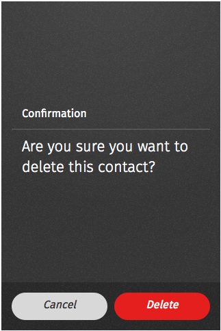
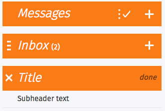
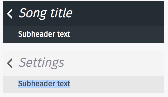

fxos-ui
=========

Provides Ember Web Components of common FirefoxOS UI widgets for use in [RecRoom]. Built using FirefoxOS [Building Blocks] from Telefonica.


Version
----

0.0.1


Installation
--------------
fxos-ui is a Bower dependency of the RecRoom yeoman generator, so you'll get access to the components when you create a new RecRoom project
```sh
npm install -g recroom
recroom new app_name
```

License
----

MPL v2.0

Widgets
-------------
## Action Menu
An action menu presents a list of actions, related to the app's content, from which the user may make a selection

#### Characteristics
* Opened from buttons within app content; these buttons are often inside toolbars (for example, the Browser app's "Share" button).
* Action menus contain one or more items.
* These menus expand in height to accomodate their items, to a maximum of the screen's height. Once that maximum height is reached, the content becomes scrollable vertically. Generally, the best practice is to try to include no more than five items plus a menu title.
* The title string is optional.
* The menu is closed by one of:
 * Selecting one of the actions.
 * Tapping the "Cancel" button.


####Example Usage
```sh
{{fxos-actionmenu title=title actionMenuButtonMapping=actionMenuButtonMapping action="fxosActionMenuActions"}}
```

Attributes
* title - The title that appears at the top of the action menu
* actionMenuButtonMapping - a map of button names to callback methods
* action - the name of the action in your controller. The Action Menu calls sendAction to send button clicks back to the controller for your current app context


#### Example Controller
```sh
Myapp.TestactionmenuController = Ember.ObjectController.extend({
	title: "This is the title",
	actionMenuButtonMapping: [
		{
			"buttonName": "Button 1",
			"buttonAction": function(){
                alert("Button 1 click");
            }
		},
		{
			"buttonName": "Button 2",
            "disabled": true,
			"buttonAction": function(){
                alert("Button 2 click");
            }
		}
	],
	actions: {
    	fxosActionMenuActions: function(data) {
            this.actionMenuButtonMapping[data-1].buttonAction();
    	}
  	}
});
```

## Buttons
Buttons perform an action when tapped by the user. Firefox OS has a wide variety of button styles to accommodate different uses and contexts.

#### Characteristics
* Buttons have two components: a visual target and a hit target. The visual target is the button the user sees on the screen. The hit target is an invisible area that responds to the tap. To minimize tapping errors, the hit target is typically larger than the visual target.
* Buttons have two states: normal and pressed.
* Disabled buttons are buttons that do not respond to a tap. Disabled buttons are dimmed.

#### Default

Default buttons are used when there are only a few actions and a list isn't needed. A primary action button uses a special highlight color to improve visibility and simplify the choice for the user. Buttons that have potentially negative consequences, such as deleting an item, are highlighted in red.


####Example Usage
```sh
{{fxos-button text="Default"}}
{{fxos-button text="Primary" cls="recommend"}}
{{fxos-button text="Danger" cls="danger"}}
```
Attributes
* cls - The cls attribute sets the CSS class of the button tag inside the web component


#### Disabled buttons

Disabled buttons do not respond to users' taps.


####Example Usage
```sh
{{fxos-button text="Default" disabled="true"}}
{{fxos-button text="Recommend" disabled="true" cls="recommend"}}
{{fxos-button text="Danger" disabled="true" cls="danger"}}
{{fxos-button text="Default" disabled="true" }}
{{fxos-button text="Recommend" disabled="true"}}
{{fxos-button text="Danger" disabled="true"}}
```

## Confirm
A confirmation prompt is used to confirm an action or inform the user of an event. Confirmation prompts are frequently used to confirm tasks that cannot be undone, such as permanently deleting an item. Confirmation prompts are designed to disrupt tasks and, as a result, should be used sparingly.

#### Characteristics
* Confirmation prompts are currently modal - they occupy the entire screen, and require user input to close them.

##### A confirmation prompt consists of:
* Title (optional)
* Body
* Icon (optional)
* A Confirmation input button, whose label can be customized
* An optional Cancel input button, whose label can be customized

#### Default


**Note:** Use the attribute formsubmit="true" in case you don't want your form to be submitted.

```sh
{{fxos-confirm
    formsubmit="true"
    title="Confirm Title"
    body="Do you want to download and install this application?"
    cancelButtonText="Cancel"
    confirmButtonText="Delete"
    confirmButtonClass="danger"
    confirmButtonEventName="confirmScreenTestEvent"
}}
```

#### Confirm with content


```sh
{{fxos-confirm
    formsubmit="true"
    title="Confirm Title"
    message="Do you want to download and install this application?"
    cancelButtonText="Cancel"
    confirmButtonText="Yes"
    confirmButtonClass="recommend"
    confirmButtonEventName="confirmScreenTestEvent"

    icon_src="http://buildingfirefoxos.com/images/BB/app_logo.png"
    icon_alt_text="Lightbox Icon"
    app_name="Lightbox"
    app_creator="Lightbox Enterprises LLC."
}}
```

## Headers

Used for labeling the active view and providing top-level navigation and inputs for the active view.Less

#### Characteristics
* A header is a horizontal bar the full width of the screen, which appears at the top of the screen in most apps.
* Headers float above content, with the option of flowing with content in special instances, such as in the Browser app.
* The heading's text provides the name of the current view.
* The heading may optionally include additional text; for example, in an email app, the number of unread messages may be displayed.
* Headers may include inputs for navigating and manipulating the current view.
* Most apps (full-screen games being an obvious exception) have a header.


#### Attributes
* class (optional) - Example: class="skin-dark"
* title (required) - Example: title="Messages"
* title_count (optional) - Example: title_count="2"
* subheader_text (optional) Example: subheader_text="Subheader text"
* back (optional) - Example: back="true"
* backEventName (optional) - Example: backEventName="headerBackButtonEvent"
* menu (optional) - Example: menu="true"
* edit (optional) - Example: edit="true"
* editEventName (optional) - Example: editEventName="headerEditButtonEvent"
* add (optional) - Example: add="true"
* addEventName (optional) - Example: addEventName="headerAddButtonEvent"
* close (optional) - Example: close="true"
* closeEventName (optional) - Example: closeEventName="headerCloseButtonEvent"
* done (optional) - Example: done="true"
* doneEventName (optional) - Example: doneEventName="headerDoneButtonEvent"


#### Default


First Default Menu Example
```sh
{{fxos-header 
    title="Messages"
    edit="true"
    editEventName="headerEditButtonEvent"
    add="true"
    addEventName="headerAddButtonEvent"
}}
```

Second Default Menu Example
```sh
{{fxos-header 
    title="Inbox"
    title_count="2"
    menu="true"
    add="true"
    addEventName="headerAddButtonEvent"
}}
```

Third Default Menu Example
```sh
{{fxos-header 
    title="Title"
    subheader_text="Subheader text"
    close="true"
    closeEventName="headerCloseButtonEvent"
    done="true"
    doneEventName="headerDoneButtonEvent"
}}
```

#### Skins


First Skinned Menu Example
```sh
{{fxos-header
    class="skin-dark"
    title="Song title"
    back="true"
    backEventName="headerBackButtonEvent"
}}
```

Second Skinned Menu Example
```sh
{{fxos-header 
    class="skin-organic"
    title="Settings"
    back="true"
    backEventName="headerBackButtonEvent"
}}
```


TODO
* Action menu - switch to events instead of action wiring
* Button - dark style
* Button - list buttons

[recroom]:https://github.com/mozilla/recroom
[Building Blocks]:http://buildingfirefoxos.com/